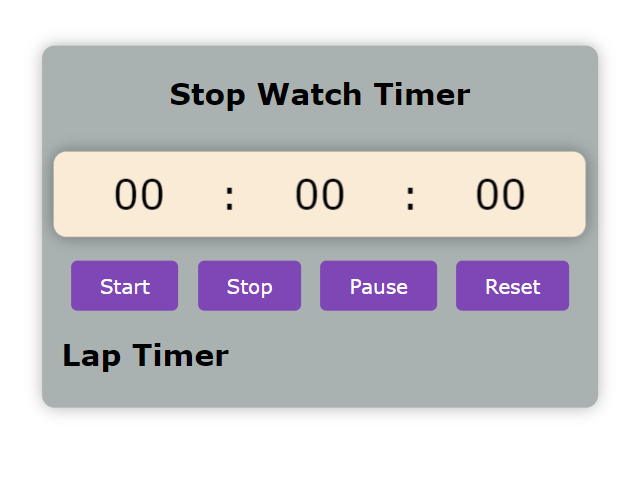
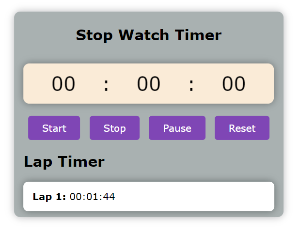
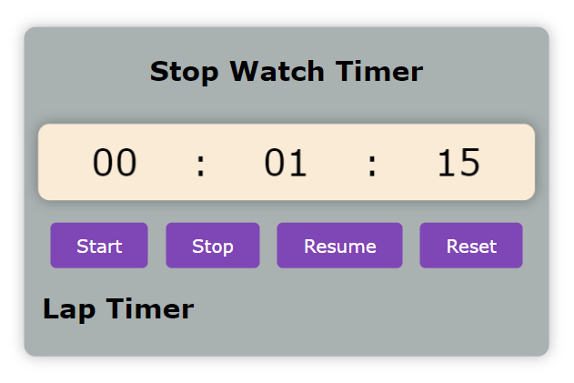

# Stop-Watch-Timer Project


A simple JavaScript project for creating a stop-watch timer.

## Features

- Start, pause, and reset functionality.
- Accurate timekeeping with milliseconds precision.
- User-friendly interface.

## Screenshots


### *reseted timer.*


### *one item lap added.*


### *paused timer.*

## Getting Started

Follow these instructions to get the project up and running on your local machine.

### Prerequisites

- Web browser with JavaScript support.

### Installation

1. Clone the repository:

    ```bash
    git clone https://github.com/your-username/stop-watch-timer.git
    ```

2. Open `index.html` in your web browser.

## Usage

- Click the "Start" button to begin the stopwatch.
- Press "Pause" to pause the timer.
- Click "Reset" to reset the stopwatch.

## Contributing

If you'd like to contribute to this project, please follow these steps:

1. Fork the project.
2. Create your feature branch (`git checkout -b feature/YourFeature`).
3. Commit your changes (`git commit -m 'Add some feature'`).
4. Push to the branch (`git push origin feature/YourFeature`).
5. Open a pull request.


